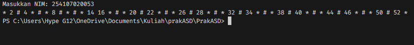
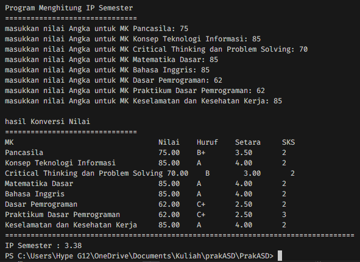
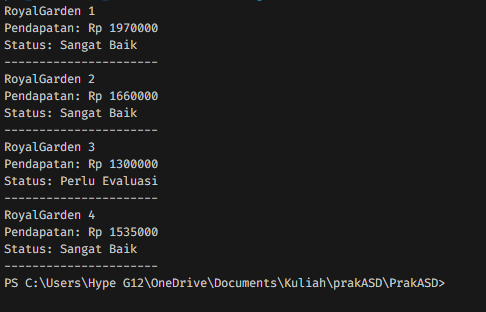
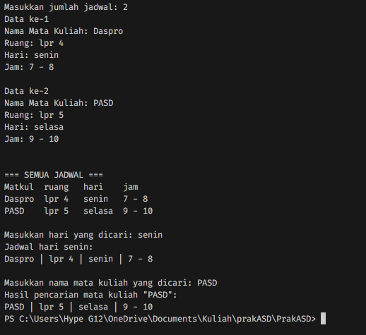

|  | Algorithm and Data Structure |
|--|--|
| NIM |  254107020053|
| Nama |  M. Tahtian Fahreza |
| Kelas | TI - 1F |
| Repository | [link] (https://github.com/tianfahreza-prog/PrakASD) |

# Labs #1 Programming Fundamentals Review

## 2.1.1. Selection Solution

Solusi ini diimplementasikan dalam Pemilihan1.java, dan di bawah ini adalah tangkapan layar hasilnya.

Ada 4 langkah utama: 
1. Masukkan semua nilai
2. Verifikasi input
3. Hitung dan konversi nilai akhir
4. Tentukan status akhir
   
   
Solusi ini diimplementasikan dalam Perulangan.java, dan di bawah ini adalah tangkapan layar hasilnya.

1. Memasukkan nomor NIM.
2. Mengambil 2 digit terakhir NIM menggunakan operasi % 100.
3. Jika 2 digit terakhir < 10, maka ditambah 10 (sebagai batas n).
4. Melakukan perulangan angka dari 1 sampai n.
5. Melewati (skip) angka 10 dan 15.
6. Logika Cetak:
   Jika habis dibagi 3 Cetak #.
   Jika genap Cetak angka tersebut.
   Jika ganjil Cetak *.
7. Menampilkan deretan simbol dan angka dalam satu baris.
   

Solusi ini diimplementasikan dalam Array.java, dan di bawah ini adalah tangkapan layar hasilnya.

1. Menyiapkan daftar nama mata kuliah dan bobot SKS masing-masing dalam array.
2. Pengguna memasukkan nilai angka untuk setiap mata kuliah.
3. Program mengubah nilai angka menjadi Nilai Huruf dan Bobot Nilai (4.0, 3.5, dst) menggunakan percabangan.
4. Mengalikan bobot nilai dengan SKS untuk mendapatkan poin mutu, lalu menjumlahkan totalnya.
5. Menampilkan tabel konversi nilai dan hasil akhir IP (Indeks Prestasi) semester.
   

Solusi ini diimplementasikan dalam Fungsi.java, dan di bawah ini adalah tangkapan layar hasilnya.
   

1. Menyimpan data stok bunga (Aglonema, Keladi, Alocasia, Mawar) untuk 4 cabang toko dalam array 2D.
2. Membuat fungsi hitungPendapatan yang mengalikan jumlah stok dengan harga masing-masing jenis bunga.
3. Membuat fungsi cekStatus untuk menentukan apakah pendapatan "Sangat Baik" (jika > 1.500.000) atau "Perlu Evaluasi".
4. Mengiterasi setiap cabang toko untuk menghitung pendapatannya masing-masing.
5. Menampilkan total pendapatan dan status performa untuk setiap cabang toko.
   

Solusi ini diimplementasikan dalam Tugas1.java, dan di bawah ini adalah tangkapan layar hasilnya.

1. Menyiapkan array 1D berisi kode plat (A, B, D, dst) dan array 2D berisi nama kota yang sesuai.
2. Pengguna memasukkan satu huruf kode plat nomor.
3. Program mencari posisi huruf tersebut di dalam array kode menggunakan perulangan.
4. Jika kode ditemukan, program mengambil baris yang sama pada array nama kota.
5. Menampilkan nama kota yang sesuai atau pesan "Kota tidak ditemukan" jika kode salah.
   

Solusi ini diimplementasikan dalam Tugas2.java, dan di bawah ini adalah tangkapan layar hasilnya.

1. Pengguna memasukkan jumlah jadwal dan mengisi detailnya (Nama MK, Ruang, Hari, Jam).
2. Menampilkan seluruh daftar jadwal yang telah diinput dalam bentuk tabel.
3. Pengguna memasukkan nama hari, lalu program menyaring dan menampilkan jadwal di hari tersebut saja.
4. Pengguna memasukkan nama mata kuliah, lalu program mencari dan menampilkan detail jadwal MK tersebut.
5. Menampilkan hasil pencarian atau filter secara spesifik sesuai input pengguna.

## 2.1.1. Selection Solution
Continue to report the result....
