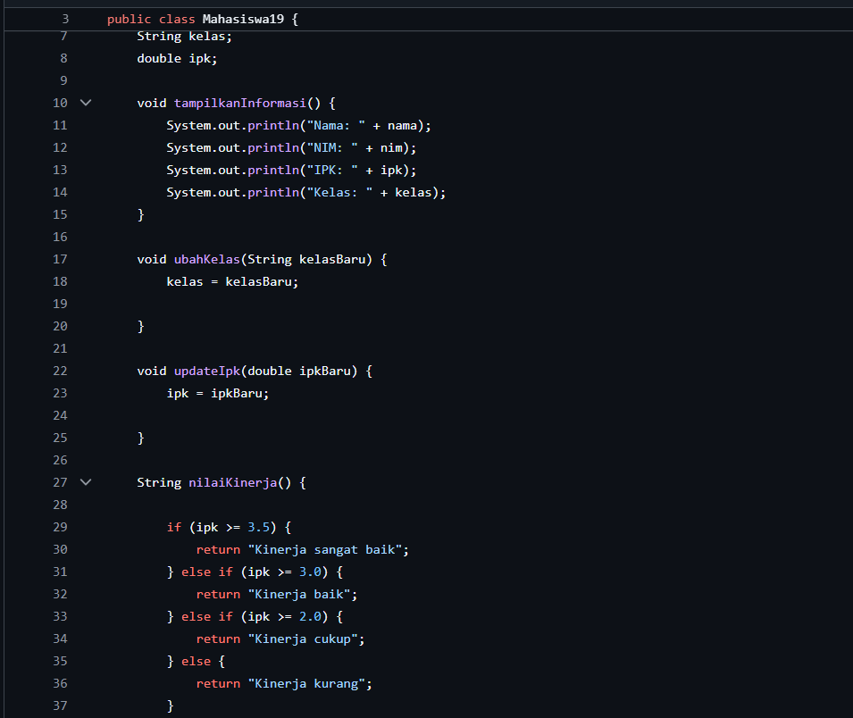
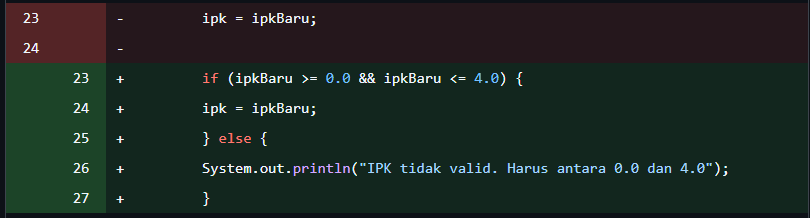
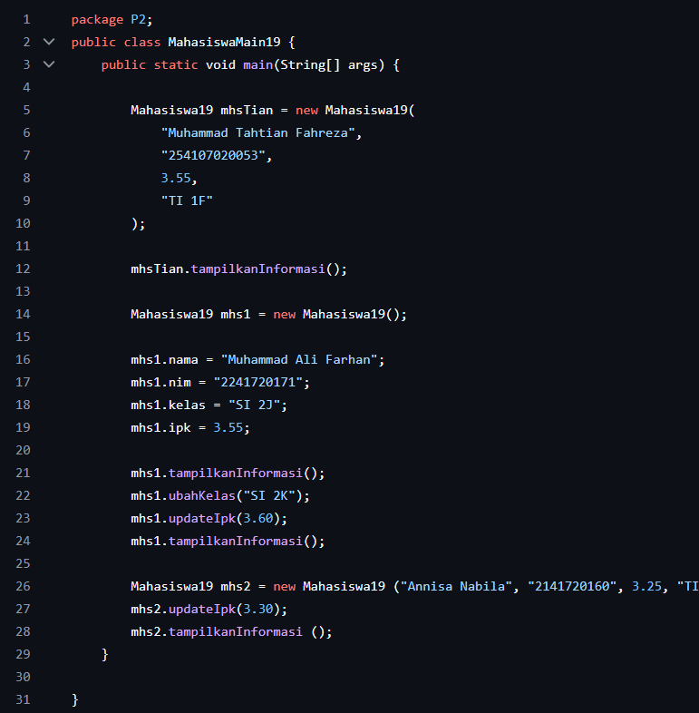
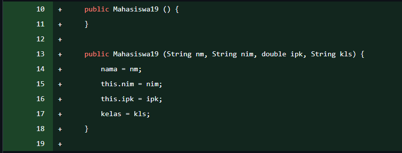
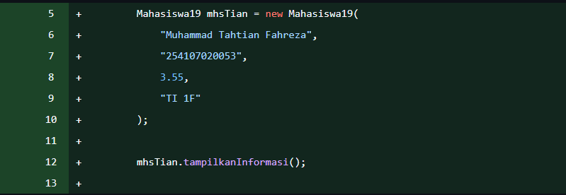
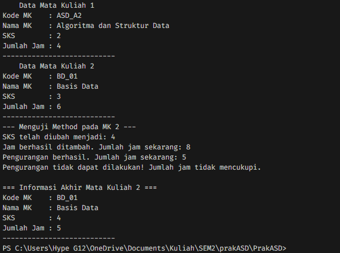

|  | Algorithm and Data Structure |
|--|--|
| NIM |  254107020053|
| Nama |  M. Tahtian Fahreza |
| Kelas | TI - 1F |
| Repository | [link] (https://github.com/tianfahreza-prog/PrakASD) |

# Labs #1 Programming Fundamentals Review

## 2.1 Percobaan 1

Solusi ini diimplementasikan dalam Mahasiswa19.java, dan di bawah ini adalah tangkapan layar hasilnya.

Pertanyaan: 
1. Sebutkan dua karakteristik class atau object!
 - Atribut dan Method
2. Perhatikan class Mahasiswa pada Praktikum 1 tersebut, ada berapa atribut yang dimiliki oleh class Mahasiswa Sebutkan apa saja atributnya!
 - ada 4, String nama, String nim, String kelas, double ipk
3. Ada berapa method yang dimiliki oleh class tersebut? Sebutkan apa saja methodnya!
 - ada 4 Method: tampilkanInformasi(), ubahKelas(), updateIpk(), nilaiKerja().
4. 

5. Jelaskan bagaimana cara kerja method nilaiKinerja() dalam mengevaluasi kinerja mahasiswa,
kriteria apa saja yang digunakan untuk menentukan nilai kinerja tersebut, dan apa yang
dikembalikan (di-return-kan) oleh method nilaiKinerja() tersebut?
 - Method nilaiKinerja() bekerja dengan mengecek nilai IPK mahasiswa, lalu membandingkannya dengan beberapa batas nilai menggunakan percabangan if-else.
 - yang dikembalikan adalah teks/keterangan kinerja mahasiswa

## 2.2 Percobaan 2
   
 
Solusi ini diimplementasikan dalam MahasiswaMain.java, dan di bawah ini adalah tangkapan layar hasilnya.

Pertanyaan:
1. Pada class MahasiswaMain, tunjukkan baris kode program yang digunakan untuk proses
instansiasi! Apa nama object yang dihasilkan?
 - Mahasiswa19 mhs1 = new Mahasiswa19();
2. Bagaimana cara mengakses atribut dan method dari suatu objek?
 - namaObjek.namaAtribut
 - namaObjek.namaMethod()
3. Mengapa hasil output pemanggilan method tampilkanInformasi() pertama dan kedua berbeda?
 - Output tampilkanInformasi() pertama dan kedua berbeda karena nilai atribut objek sudah berubah sebelum pemanggilan kedua.

## 2.3 Percobaan 3

Pertanyaan:
1. Pada class Mahasiswa di Percobaan 3, tunjukkan baris kode program yang digunakan untuk
mendeklarasikan konstruktor berparameter!
 - public Mahasiswa19 (String nm, String nim, double ipk, String kls) {
        nama = nm;
        this.nim = nim;
        this.ipk = ipk;
        kelas = kls;
    }
2. Perhatikan class MahasiswaMain. Apa sebenarnya yang dilakukan pada baris program
berikut? Mahasiswa19 mhs2 = new Mahasiswa19 ("Annisa Nabila", "2141720160", 3.25, "TI 2L") ;
 - Membuat objek baru
 - Memanggil konstruktor berparameter
 - Menyimpan referensi objek
   Objek yang dibuat tadi disimpan ke variabel mhs2.
3. Hapus konstruktor default pada class Mahasiswa, kemudian compile dan run program.
Bagaimana hasilnya? Jelaskan mengapa hasilnya demikian!
 - ERROR, Karena Java tidak menemukan contruktor tanpa parameter lagi
4. Setelah melakukan instansiasi object, apakah method di dalam class Mahasiswa harus diakses
secara berurutan? Jelaskan alasannya
 - tidak, Karena setelah object dibuat, semua method di dalam class bisa dipanggil bebas sesuai kebutuhan.
5. Buat object baru dengan nama mhs<NamaMahasiswa> menggunakan konstruktor
berparameter dari class Mahasiswa!

## Latihan Praktikum 
   
1.   

2. 

